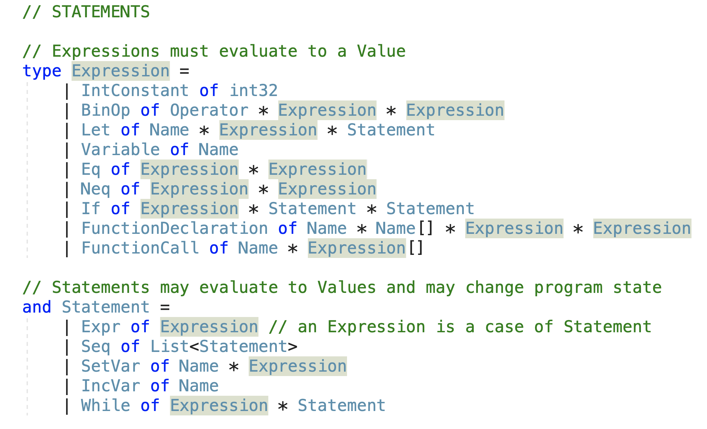

# Functional Interpreter

This library supports the interpreting of **imperative** statements
using strictly **functional** techniques.

These statements can be composed to create basic programs with changing state.
For example, the values associated with variables may change.


## List of Statements:
The following is a list of supported statements and how they are represented in the library:




## Composing a basic program:

Take a look at demo.fs for an extensive list of example programs.

To compose a program, nest the statement constructors within one another:
```F#
let prog3A =
    Expr(
        Let(
            Name("x"), 
            IntConstant(700), 
            Expr(BinOp(
                    DIV, 
                    Variable(Name("x")), 
                    IntConstant(2))))
    )
```

## Running the interpeter:

To run the interpreter, use the evaluate function on a statement:
```F#
let result = evaluate prog5
let result_string = result.ToString()

printfn "%s" result_string
```


## Implementation Notes:

Interpreting imperative statements with the functional paradigm poses a challenge since a functional environment cannot change its state (e.g. values of variables) in the same way that an imperative environment can.

Using the library's **Environment** type, the functional interpreter simulates an immutable linked list to store the current value of all variables. When a value is changed, a new Environment is produced that reflects the change to the old environment.

Both the intrepeter and the fundamental statement types are all written in F#.
