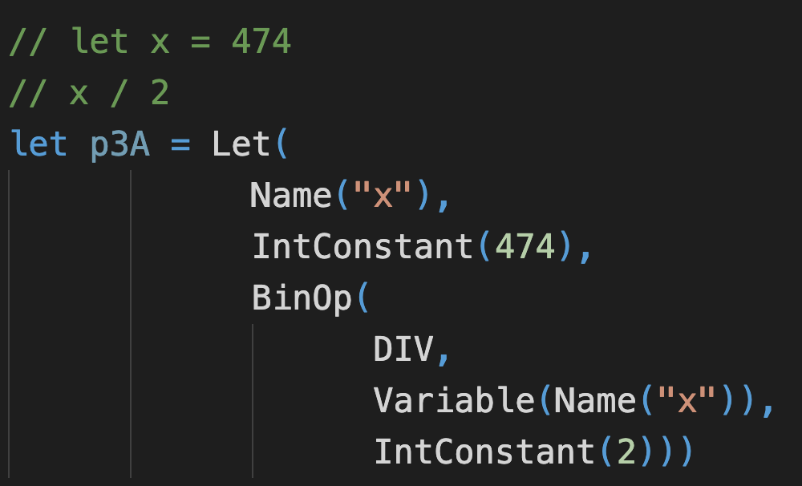

# BasicInterpreter

This library allows the user to interpret a variety of Expressions.
These Expressions can be composed to create basic programs.

Both the intrepeter and the various expression types are all written in F#.

## List of Expressions:

## Composing a basic program:

## Running the interpeter:

